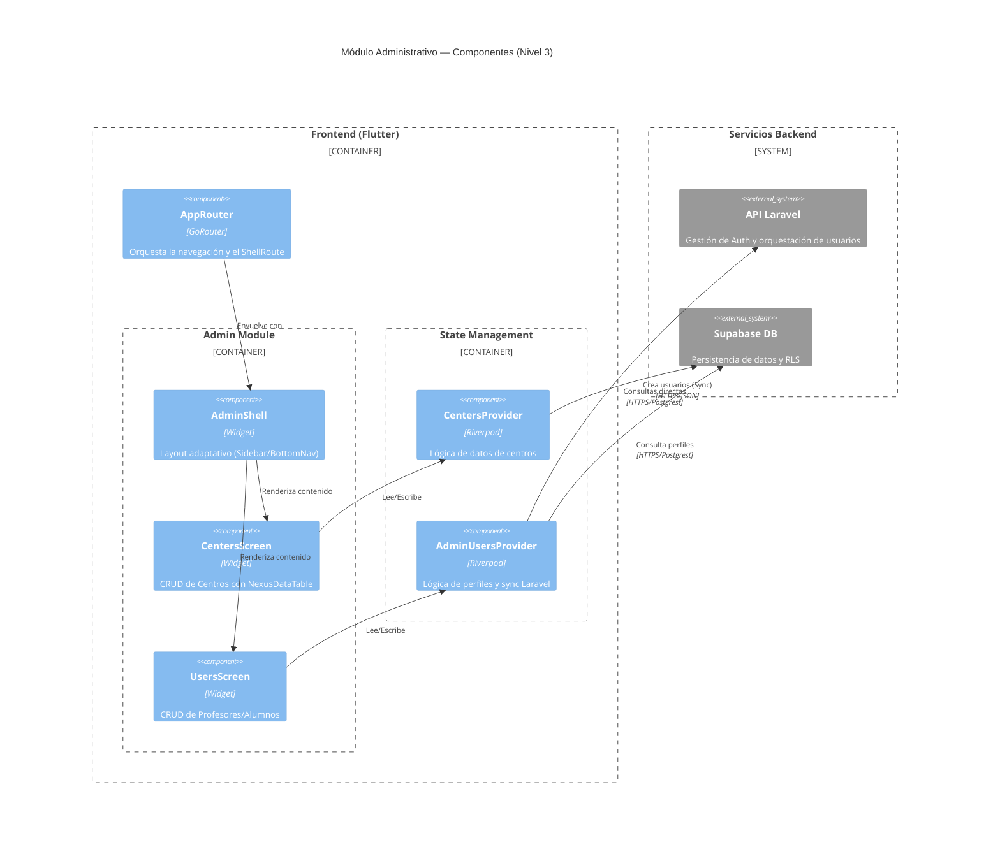

# Arquitectura del Módulo Administrativo

Este diagrama describe los componentes internos del módulo de administración y su interacción con el sistema de navegación y datos.

## Para Stakeholders
**Eficiencia Operativa**: El sistema está diseñado para que la creación de un nuevo colegio o profesor se refleje instantáneamente en la base de datos sin tiempos de espera perceptibles para el administrador.
**Escalabilidad**: Esta estructura permite añadir nuevos módulos (ej. Facturación o Inventario) simplemente añadiendo rutas al `AdminShell` existente, sin afectar lo que ya funciona.
